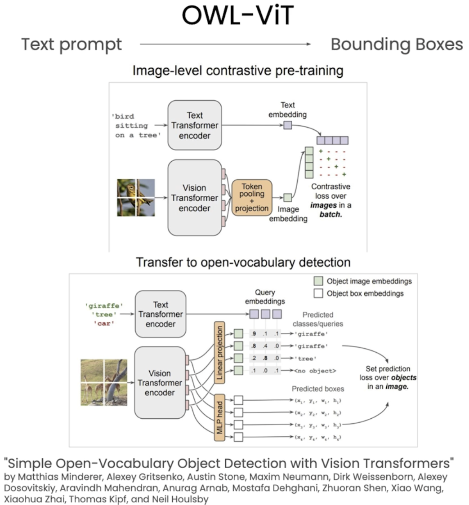

# Object Detection
In the provious notebook we saw how to create masks via points and bounding boxes. Here we will see how we can use **natural text** to generate these masks. In order to do this we are going to use a pipeline of models, the output of the first model will be fed into the second model. The first model in this pipeline will be a **zero-shot object detection model**, which will then be followed by a SAM model that will take the generated bounding box from the zero-shot object detection.<br>
The zero-shot object detection model we will be using is called **OWL-ViT**. This model can detect objects within an image based on simple text prompts. The fact that it is a zero-shot model, means that we don't need to train it in any way for it to detect any object within an image. The way we will be using OWL-ViT within this is by using a text prompt that is a string of text to generate a bounding box.<br>
<br>
The OWL-ViT was trained on two tasks, one pre-training phase and a second fine tuning phase. In the pre-training phase,the model learns to associate an image with a piece of text using a technique that leverages contrastive loss, and this process allows the OWL-ViT model to develop a strong understanding of both an image and its corresponding text. In order to achieve good performance, it also required a fine tuning stage. During this stage the model is trained specifically for object detection. While in the pre-training phase the model was just learning how to associate a piece of text and an image, during the fine tuning stage, the model learns to identify, object and associate them with a particular word or string.<br>

We will create a Comet experiment which will allow us to compare the generated masks that will be produced at the end of this pipeline.
```python
import comet_ml
comet_ml.init(anonymous=True, project_name="3: OWL-ViT + SAM")
exp = comet_ml.Experiment()
```
Here we have created an anonymous Comet experiment means we do not need to create a Comet account to get access to the Comet functionality.
