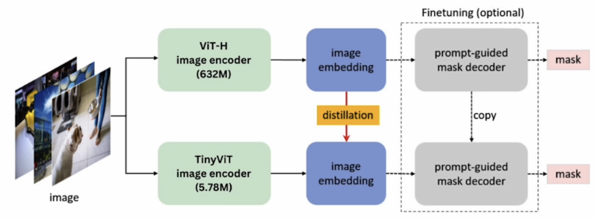
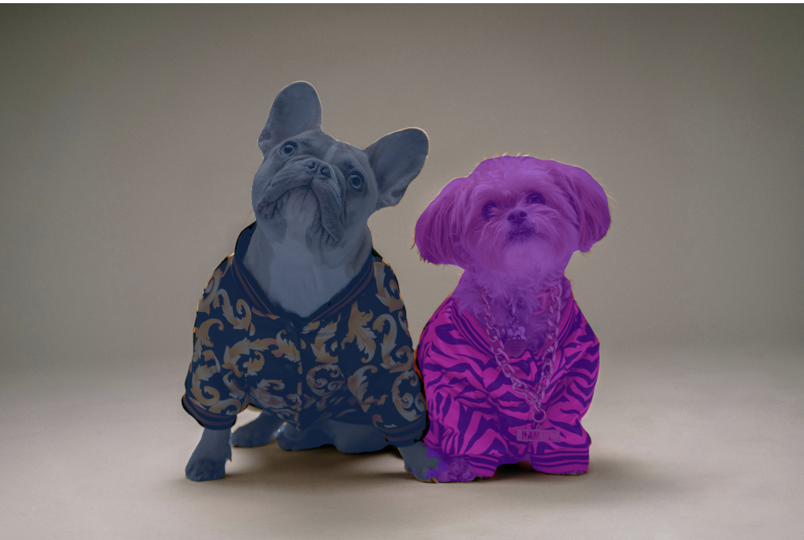

# Object Detection
In the provious notebook we saw how to create masks via points and bounding boxes. Here we will see how we can use **natural text** to generate these masks. In order to do this we are going to use a pipeline of models, the output of the first model will be fed into the second model. The first model in this pipeline will be a **zero-shot object detection model**, which will then be followed by a SAM model that will take the generated bounding box from the zero-shot object detection.<br>
The zero-shot object detection model we will be using is called **OWL-ViT**. This model can detect objects within an image based on simple text prompts. The fact that it is a zero-shot model, means that we don't need to train it in any way for it to detect any object within an image. The way we will be using OWL-ViT within this is by using a text prompt that is a string of text to generate a bounding box.<br>
<br>
The OWL-ViT was trained on two tasks, one pre-training phase and a second fine tuning phase. In the pre-training phase,the model learns to associate an image with a piece of text using a technique that leverages contrastive loss, and this process allows the OWL-ViT model to develop a strong understanding of both an image and its corresponding text. In order to achieve good performance, it also required a fine tuning stage. During this stage the model is trained specifically for object detection. While in the pre-training phase the model was just learning how to associate a piece of text and an image, during the fine tuning stage, the model learns to identify, object and associate them with a particular word or string.<br>

We will create a Comet experiment which will allow us to compare the generated masks that will be produced at the end of this pipeline.
```python
import comet_ml
comet_ml.init(anonymous=True, project_name="3: OWL-ViT + SAM")
exp = comet_ml.Experiment()
```
Here we have created an anonymous Comet experiment means we do not need to create a Comet account to get access to the Comet functionality.
```python
from PIL import Image
logged_artifact = exp.get_artifact("L3-data", "anmorgan24")
local_artifact = logged_artifact.download("./")

raw_image = Image.open("Images/dog.jpg")
```
We will be using Comet artifacts to load all the images.

```python
from transformers import pipeline
OWL_checkpoint = "google/owlvit-base-patch32"
```
In order to access the OWL-ViT model we will be using the Transformers library and specifically the pipeline method.
```python
# Load the model
detector = pipeline(
    model= OWL_checkpoint,
    task="zero-shot-object-detection"
)
```
First specify what you want to identify in the image via prompt.
```python
prompt = "dog"
```
Then pass this prompt to the detector model that you have just loaded to generate the bounding boxes of the dogs in the image. Pass the prompt in **list** format as it is possible to pass in multiple text prompts.
```python
output = detector(
    raw_image,
    candidate_labels = [prompt]
)
output
```
```python
OUTPUT -->
[{'score': 0.19028441607952118,
  'label': 'dog',
  'box': {'xmin': 888, 'ymin': 376, 'xmax': 2280, 'ymax': 2432}},
 {'score': 0.17161825299263,
  'label': 'dog',
  'box': {'xmin': 2026, 'ymin': 728, 'xmax': 3116, 'ymax': 2436}}]
```
The model identifies both images for the label dog in two different positions.
```python
from utils import preprocess_outputs
input_scores, input_labels, input_boxes = preprocess_outputs(output)
from utils import show_boxes_and_labels_on_image
```
The **`preprocess_outputs`** function simply takes the output above and reformat it to make it easier to plot the bounding boxes on the image.
```python
# Show the image with the bounding boxes
show_boxes_and_labels_on_image(
    raw_image,
    input_boxes[0],
    input_labels,
    input_scores
)
```
<br>
The model has been able to take a text input dog and generate two bounding boxes highlighting each dog on the image. It was even able to overlap the bounding boxes of the two dogs. So based on a simple text prompt we have successfully generated bounding boxes on both the dogs.

### Get Segmentation Masks using Mobile SAM
Now we will use the bounding boxes to get the segmented masks. Instead of using **Fast SAM** as in the previous notebook we will use **Mobile SAM** model. The Mobile SAM model has been optimized to run on devices that might not have access to GPUs.<br>
<br>
In order to perform more efficiently, it works on **Model Distillation** which allows us to take a very large model and transfer its knowledge to a smaller model, and this allows us to run the model a lot more efficiently. Model Distillation is a different technique compared to model compression techniques or quatization in the sense that it doesn't actually change the model format, but trains an entirely new and much smaller model.
```python
from ultralytics import SAM
```
```python
SAM_version = "mobile_sam.pt"
model = SAM(SAM_version)
```
Info about [mobile_sam.pt](https://docs.ultralytics.com/models/mobile-sam/)<br>
similar to the previous notebook we will define labels to specify the bounding box belongs to the object we would like to segment or the background.
```python
import numpy as np
labels = np.repeat(1, len(output))
labels #--> array([1, 1])
```
As we are making a pipeline in which the output of first model is fed into the next model, we will use the **`.repeat()`** method of NumPy to create an array of ones with the dimensions same as the output. We can then use the **raw image, bounding boxes** and **labels** to generate the segmented mask.
```python
result = model.predict(
    raw_image,
    bboxes=input_boxes[0],
    labels=labels
)
```
```python
OUTPUT -->
0: 1024x1024 16282.0ms
Speed: 7.9ms preprocess, 16282.0ms inference, 200.6ms postprocess per image at shape (1, 3, 1024, 1024)
```
```python
result
```
Within a second we were able to generate the mask using the highly optimized Mobile SAM model. The **`predict()`** function returns a result object that contains not just the masks but also the original image and additional metadata. We can extract the mask from the result using the below given code.
```python
masks = result[0].masks.data
masks
```
The Mask is simply a series of **False** and **True** booleans, which indicates whether a particular pixel belongs to the background or the generated mask respectively. To visualize the masks we will use the function from the utils library.
```python
from utils import show_masks_on_image

show_masks_on_image(
    raw_image,
    masks
)
```
<br>
 
